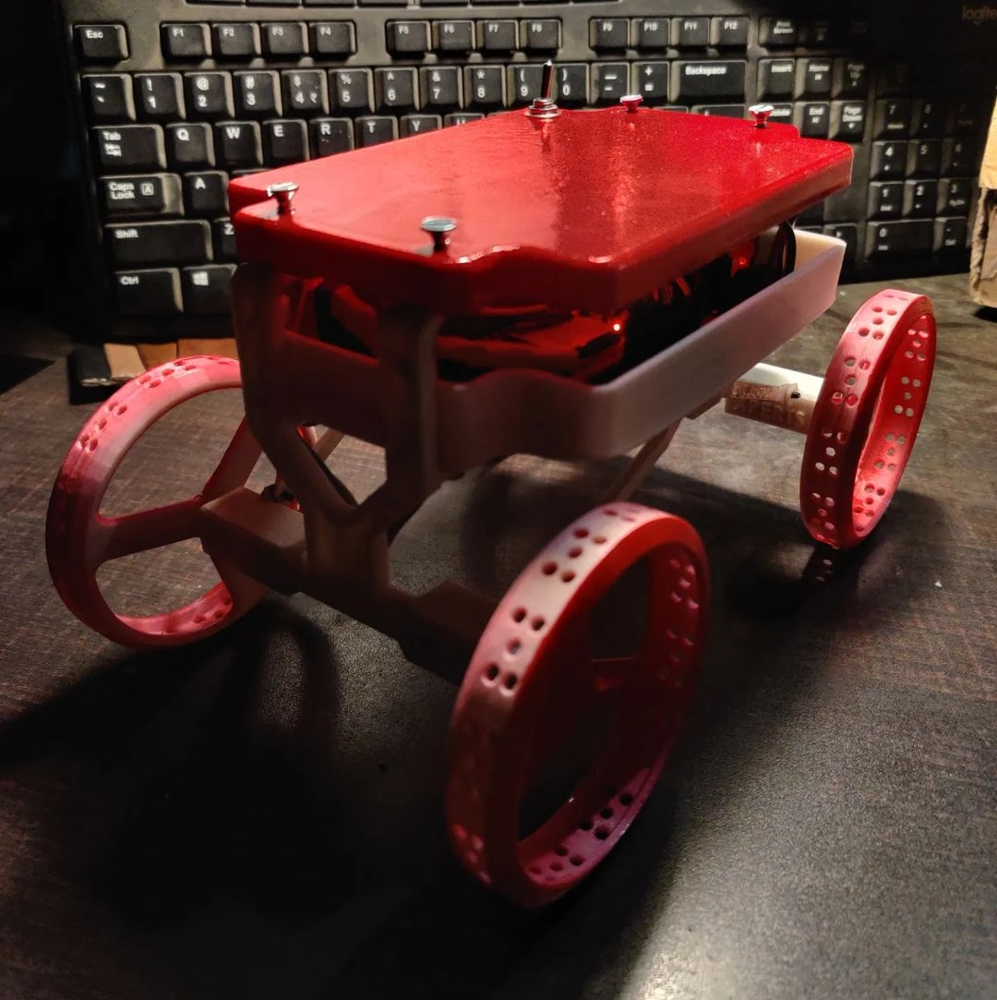

<<<<<<< HEAD
# BotIsh

**BotIsh** is a WiFi-controlled robot with real-time commands sent from an Android application using UDP communication. The robot is controlled by an ESP32 microcontroller, and its movement commands are sent from an Android app. The project utilizes the WiFi capabilities of the ESP32 to set up a soft access point for communication.

## Table of Contents
- [Features](#features)
- [Hardware Requirements](#hardware-requirements)
- [Software Requirements](#software-requirements)
- [Setup and Installation](#setup-and-installation)
- [Usage](#usage)
- [Images](#images)
- [License](#license)

## Features
- Real-time control of robot movements (Forward, Backward, Left, Right, Stop) via an Android app.
- Speed control through a SeekBar in the app.
- WiFi-based communication between the Android app and ESP32 using UDP protocol.
- Easy to configure and extend for further functionalities.

## Hardware Requirements
- ESP32 microcontroller
- L298N motor driver
- DC motors
- Power supply for the motors
- WiFi-enabled Android device
- Chassis and wheels for the robot

## Software Requirements
- **ESP32 libraries:**
  - `WiFi.h` for WiFi control
  - `AsyncUDP.h` for UDP communication
- Arduino IDE
- Android Studio for Android app development

## Setup and Installation

### ESP32 Code Setup:
1. Install the **ESP32** board package in Arduino IDE.
2. Install the necessary libraries: `WiFi.h` and `AsyncUDP.h`.
3. Upload the provided `bot_code.ino` to your ESP32 board.
4. Make sure the ESP32 is connected to your motor driver and motors correctly.

### Wiring Diagram:
Connect the ESP32 to the motor driver (L298N) as follows:
- `IN1` - Pin 27
- `IN2` - Pin 26
- `ENA` - Pin 14
- `IN3` - Pin 25
- `IN4` - Pin 33
- `ENB` - Pin 32

## Usage

1. Power on the ESP32 and the robot.
2. Connect to the WIFI started by ESP32.
3. Open the **BotIsh** app on your Android device.
4. Use the control buttons to move the robot forward, backward, left, or right.
5. Adjust the speed using the SeekBar.
6. Stop the robot by releasing the control button.

## Images

### BotIsh Robot

### BotIsh Android App Screenshot

### [CAD File](https://cad.grabcad.com/library/cube-rover-by-astrobotic-1)

## License
This project is licensed under the MIT License - see the [LICENSE](LICENSE) file for details.

---